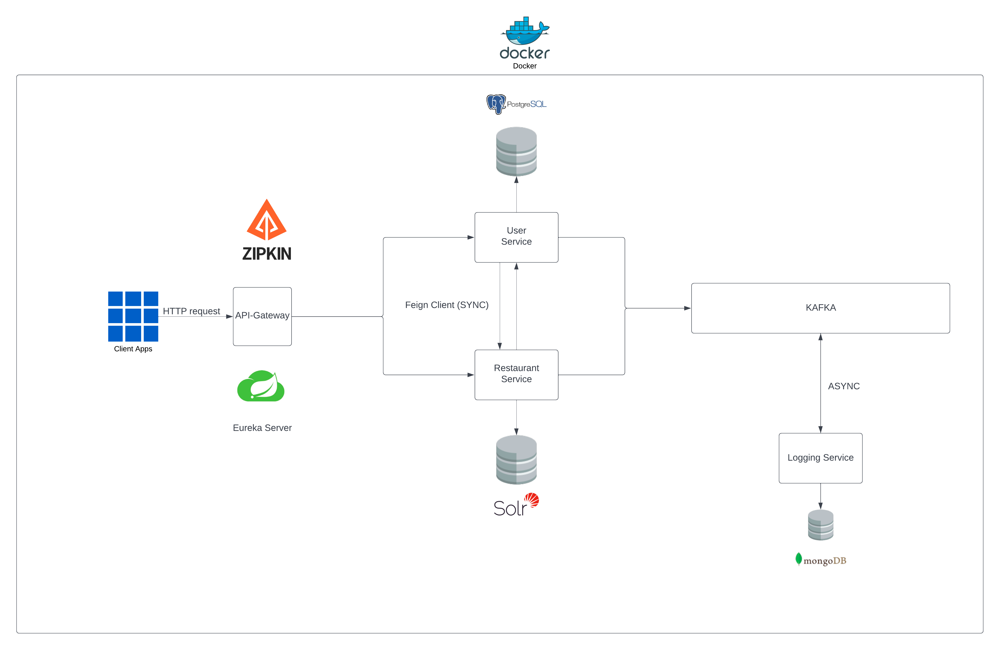

# Dine Experience Application

[Go to Turkish README](README_TR.md)

## Project Architecture and System Design

The Dine Experience Application is a comprehensive project developed for the N11 TalentHub Backend Bootcamp. This application is built using a microservices architecture and consists of five main modules: discovery-server, api-gateway, user-service, restaurant-service, and logging-service. The Discovery Server serves as a service registry that enables effective communication between microservices. The API Gateway serves as the single entry point for all client requests and forwards them to the appropriate service. The User Service manages users and their reviews for restaurants, providing functions such as user registration, posting reviews, and personalized restaurant recommendations based on user location and restaurant ratings. The Restaurant Service manages all operations related to restaurants, including restaurant registration and listing, and stores all restaurant data in Apache Solr. The Logging Service is a logging service for a Spring Boot application. It uses Apache Kafka for message consumption and MongoDB for data storage. The service is designed to consume error logs from Kafka, store them in MongoDB, and provide an API for retrieving the logs. Each service in this repository has its own README.md file, providing detailed information about the project.

## Services

- [Discovery Server](./discovery-server/README.md): A Spring Boot application that provides service discovery and registration. It uses Netflix Eureka to register and discover services. The Discovery Service is the single entry point for all clients. It forwards requests to the appropriate service.

- [API Gateway](./api-gateway/README.md): A Spring Boot application that provides a RESTful API for managing users and restaurants. It includes operations for creating, retrieving, updating, and deleting users and restaurants. The API Gateway is the single entry point for all clients. It forwards requests to the appropriate service. It also provides a way to authenticate and authorize users.

- [User Service](./user-service/README.md): A Spring Boot application that provides a RESTful API for managing users and user reviews. It includes operations for creating, retrieving, updating, and deleting users and user reviews. Each user has associated latitude and longitude values. User reviews have a score between 1 and 5.

- [Restaurant Service](./restaurant-service/README.md): A Spring Boot application that provides a RESTful API for managing restaurants. It includes operations for creating, retrieving, updating, and deleting restaurants. Each restaurant has associated latitude and longitude values. The data for the restaurants is stored in Apache Solr and queries are also made to Solr. The service also provides an API for recommending restaurants to users based on their location and the restaurant's score.

- [Logging Service](./logging-service/README.md): This is a logging service for a Spring Boot application. It uses Apache Kafka for message consumption and MongoDB for data storage. The service is designed to consume error logs from Kafka, store them in MongoDB, and provide an API for retrieving the logs.
