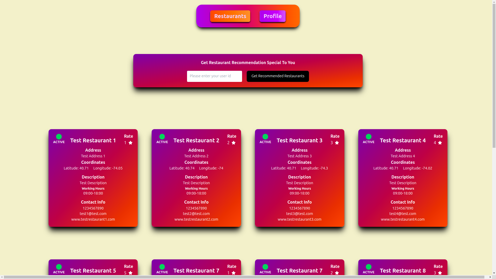

# Dine Experience Frontend

[English](README.md)

Bu, N11 TalentHub Backend Bootcamp için geliştirilen kapsamlı Dine Experience uygulamasının frontend kısmıdır. Bu frontend, kullanıcıların kaydolmasını, yorum göndermesini ve konumlarına ve restoran puanlarına dayalı kişiselleştirilmiş restoran önerileri almasını sağlayan uygulamanın backend hizmetleriyle etkileşimde bulunmak üzere tasarlanmıştır.

## Başlarken

Bu talimatlar, projenin yerel makinenizde geliştirme ve test amacıyla çalışmasını sağlar.

### Önkoşullar

Makinenizde Node.js ve npm yüklü olması gerekmektedir. Eğer bunlar yüklü değilse, [buradan](https://nodejs.org/en/download/) indirebilirsiniz.

### Kurulum

1. Depoyu klonlayın
```bash
git clone https://github.com/sserhatacarr/dineXperienceApp
```

2. Dizine gidin
```bash
cd frontend
```

3. Bağımlılıkları yükleyin
```bash
npm install
```

4. Geliştirme sunucusunu başlatın
```bash
npm run dev
```

Artık, frontend [http://localhost:5173](http://localhost:5173) adresinde çalışıyor olmalıdır.

## Kullanılan Teknolojiler

* [React](https://reactjs.org/) - Kullanılan web çatısı
* [npm](https://www.npmjs.com/) - Bağımlılık Yönetimi

## Ekran Görüntüleri



## Lisans

MIT Lisansı altında dağıtılmaktadır. Daha fazla bilgi için [`LICENSE`](LICENSE) dosyasına bakın.

## License

Distributed under the MIT License. See [`LICENSE`](LICENSE) for more details.

<!-- CONTACT -->

## Contact

### Serhat Acar

<a href="https://github.com/sserhatacarr" target="_blank">

</a>
<a href = "mailto:sserhatacarr@outlook.com?subject = Feedback&body = Message">

</a>
<a href="https://linkedin.com/in/sserhatacarr" target="_blank">

</a>  

## Talenthub Bootcamp - N11 & Patika

<div align="center">
  <a href="https://www.n11.com/">
    
  </a>

<h3 align="center">Company: N11.com</h3>
</div>

<div align="center">
  <a href="https://www.patika.dev/">
    
  </a>
<h3 align="center">Organizer: Patika.dev</h3>   
</div>